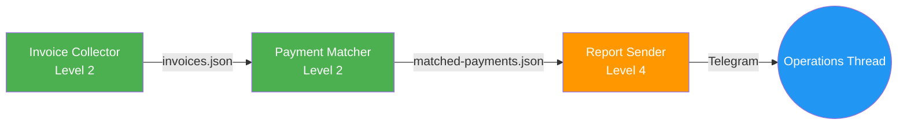

# Phase 3: Interview and Design Phases - Research

**Researched:** 2026-04-14
**Domain:** Conversational protocol design for Claude Code skill reference files (interview + agent team design)
**Confidence:** HIGH

## Summary

Phase 3 populates two existing stub reference files (`references/phase-1-interview.md` and `references/phase-2-design.md`) with the complete conversational protocols Claude follows during the first two AgentBloc phases. The interview protocol must cover 9 categories with hybrid navigation (mandatory seed questions + adaptive branching), progressive data classification across all categories, and a summary-of-understanding gate. The design protocol must produce agent identification, topology selection, per-agent contracts, governance specs, blast-radius scoring, and visual diagrams (ASCII + Mermaid).

This phase is pure markdown authoring. No code, no external dependencies, no runtime changes. The deliverables are reference files that Claude loads at phase entry to guide its conversational behavior. The challenge is not technical but structural: designing protocols that are precise enough to produce consistent behavior while flexible enough to handle diverse business workflows. The security reference files from Phase 2 (data-classification.md, blast-radius.md, credentials.md, etc.) are already populated and must be integrated into both protocols.

A secondary deliverable is populating `references/frameworks.md` with patterns borrowed from CrewAI (role-based DSL), LangGraph (stateful topology), and n8n (visual DAG composition) that the design protocol references when making agent team decisions.

**Primary recommendation:** Structure each reference file with a table of contents, explicit protocol sections, and self-contained decision trees. Follow the pragmatic format established by the Phase 2 security reference files (2-3 pages of actionable patterns, not enterprise playbooks). The interview protocol should be ~200-300 lines; the design protocol ~250-350 lines; the frameworks reference ~100-150 lines.

<user_constraints>
## User Constraints (from CONTEXT.md)

### Locked Decisions
- **D-01:** Hybrid navigation: each of the 9 categories has 2-3 mandatory seed questions, then Claude branches adaptively based on answers. Guaranteed minimum coverage with flexibility to follow the conversation.
- **D-02:** Internal checklist for completion: each category has 3-5 "must-know" items. Claude tracks them silently. When all are covered (through any question path), the category is done. User never sees the checklist.
- **D-03:** Strictly one question per turn. Always. Matches INTV-02. Non-technical users don't get overwhelmed.
- **D-04:** Soft framing at start of interview: "I'll ask about 15-25 questions across 9 areas to fully understand your workflow." No further progress tracking during the interview.
- **D-05:** Both table overview + expandable cards. First show a summary table of the full agent team (Name, Role, Inputs, Outputs, Blast-Radius, Model), then detail each agent individually with a full contract card (name, role description, inputs/outputs, tools/integrations, trigger/schedule, blast-radius level, model recommendation, failure handling).
- **D-06:** Both ASCII + Mermaid for topology diagram. ASCII inline in conversation for immediate readability, Mermaid in deployment artifacts for documentation/GitHub rendering.
- **D-07:** Topology recommendation with rationale: Claude analyzes the workflow and recommends one topology (pipeline/mesh/hierarchy/swarm) with a brief explanation why. User can override.
- **D-08:** Progressive data classification throughout the entire interview, not limited to the Data category. Any data mention in any category triggers classification (a name in "People" triggers PII, a payment in "Services" triggers financial). Running tally updated continuously using auto-detection patterns from references/data-classification.md.
- **D-09:** Blast-radius auto-scored with override: Claude assigns blast-radius level per agent automatically based on its tools/permissions during design. Shown in the agent card. User can override.
- **D-10:** Interview summary includes an integrated "Security Profile" section: data classes found, compliance regimes activated (GDPR/HIPAA/PCI), and implications for the design phase. Security is part of the workflow summary, not a separate concern.

### Claude's Discretion
- How CrewAI/LangGraph/n8n framework patterns are woven into design decisions (explicit references, implicit influence, or contextual comparison depending on user's tech level)
- Exact seed questions per interview category (as long as 2-3 mandatory seeds exist per category)
- Exact must-know checklist items per category (as long as 3-5 items per category)
- Agent card formatting and Mermaid diagram style
- How to handle interview categories that overlap (e.g., data mentions in Services vs Data category)

### Deferred Ideas (OUT OF SCOPE)
- Framework comparison matrix as a standalone reference (if the user wants explicit CrewAI vs LangGraph comparison during design, that could be its own reference file -- currently left to Claude's discretion)
</user_constraints>

<phase_requirements>
## Phase Requirements

| ID | Description | Research Support |
|----|-------------|------------------|
| INTV-01 | Deep interview covering 9 categories: Problem, Workflow, Services, Data, Data Classification, People, Edge Cases, Reporting, Budget/Constraints | Interview protocol structure with 9 category sections, each containing seed questions and must-know checklists |
| INTV-02 | Questions asked one at a time; each answer shapes the next question | One-question-per-turn protocol enforced in interview instructions; adaptive branching rules |
| INTV-03 | Interview completion checklist: workflow understood, services mapped, data model known, edge cases covered, tech level assessed, budget/constraints confirmed | Internal completion checklist pattern with 3-5 must-know items per category tracked silently |
| INTV-04 | Summary of understanding presented; user must confirm before proceeding | Summary-of-understanding gate format with structured output template and Security Profile section |
| DESG-01 | Agent identification: each distinct responsibility = one agent with clear naming | Agent identification rules borrowing CrewAI role-based DSL pattern (role, goal, responsibility) |
| DESG-02 | Topology selection (pipeline/mesh/hierarchy/swarm) with decision criteria | Topology decision tree with 5 pattern definitions and selection criteria from orchestration research |
| DESG-03 | Per-agent contracts: inputs, outputs, dependencies, model recommendation | Agent contract card template with all fields specified |
| DESG-04 | Schedule/trigger definition (cron, on-demand, event-triggered) | Schedule definition patterns integrated into agent contract cards |
| DESG-05 | Governance specification: budgets, permissions, human approval requirements | Governance spec template referencing blast-radius.md approval matrix and credentials.md hierarchy |
| DESG-06 | Blast-radius scoring per agent; top two levels force requires_approval: true | Integration with existing blast-radius.md scoring decision tree and permission minimization checklist |
| DESG-07 | Best-of-breed framework patterns referenced during design | Framework pattern reference file (frameworks.md) with CrewAI, LangGraph, n8n patterns mapped to AgentBloc decisions |
| DESG-08 | Visual agent interaction diagram (ASCII) + agent summary table | ASCII diagram pattern and Mermaid diagram template; summary table format |
</phase_requirements>

## Standard Stack

This phase is pure markdown content authoring. There is no software stack. The "stack" is the existing file infrastructure.

### Core: Files to Populate
| File | Current State | Target Size | Purpose |
|------|--------------|-------------|---------|
| `references/phase-1-interview.md` | 48-line stub with 9 section headers | ~200-300 lines | Complete interview protocol with seed questions, checklists, adaptive branching rules |
| `references/phase-2-design.md` | 11-line stub with purpose statement | ~250-350 lines | Complete design protocol with agent identification, topology, contracts, governance |
| `references/frameworks.md` | 12-line stub with purpose statement | ~100-150 lines | CrewAI/LangGraph/n8n patterns mapped to AgentBloc design decisions |

### Supporting: Files to Integrate With (Read-Only)
| File | Lines | Integration Point |
|------|-------|-------------------|
| `references/data-classification.md` | 138 | Interview protocol references auto-detection rules during progressive classification |
| `references/blast-radius.md` | 129 | Design protocol references scoring decision tree during agent card generation |
| `references/credentials.md` | 118 | Design protocol references credential hierarchy during governance specs |
| `references/audit-logging.md` | 190 | Design protocol references audit patterns during governance specs |
| `references/gdpr-patterns.md` | 275 | Design protocol references compliance patterns when GDPR/HIPAA/PCI activated |
| `references/prompt-injection.md` | 179 | Design protocol references injection defense during agent design |
| `references/incident-response.md` | 213 | Design protocol references kill switch during governance specs |
| `examples/arco-rooms.md` | 58 | Both protocols reference as concrete example of all 11 patterns |
| `SKILL.md` | 160 | Hub file that loads these references; may need minor loading adjustment for D-08 |

### SKILL.md Loading Adjustment
The current SKILL.md (line 94-95) conditionally loads data-classification.md: "If the user's data involves PII, PHI, or financial information, also read..." Decision D-08 (progressive classification throughout all categories) means data-classification.md should be loaded unconditionally at interview start, not conditionally after PII is detected. SKILL.md needs a minor edit to make this unconditional. [VERIFIED: reading SKILL.md lines 94-95]

## Architecture Patterns

### Reference File Structure Pattern

Follow the format established by the Phase 2 security reference files. Each reference file should have: [VERIFIED: reading existing security reference files]

```markdown
# Title

> One-line purpose statement for when/why this file is loaded.

## Table of Contents

- [Section 1](#section-1)
- [Section 2](#section-2)
...

## When This Applies

Context for when Claude reads this file, what triggers it, and how it shapes downstream phases.

## [Protocol Sections]

Actionable content: decision trees, templates, checklists, examples.

## Quick Reference

Summary table for fast lookup during conversation.
```

### Interview Protocol Structure

```
references/phase-1-interview.md
  Purpose statement
  Table of Contents
  When This Applies
  Interview Opening Protocol (soft framing, tech level detection)
  Progressive Data Classification Protocol (cross-references data-classification.md)
  9 Category Sections:
    The Problem
      Seed questions (2-3)
      Must-know checklist (3-5 items)
      Adaptive branching hints
    The Current Workflow
      ...
    The Services and Tools
      ...
    The Data
      ...
    Data Classification
      ...
    The People
      ...
    Edge Cases and Failures
      ...
    Reporting and Communication
      ...
    Budget and Constraints
      ...
  Interview Completion Gate
  Summary-of-Understanding Template (with Security Profile)
  Quick Reference
```

### Design Protocol Structure

```
references/phase-2-design.md
  Purpose statement
  Table of Contents
  When This Applies
  Design Opening (receive interview summary, load security context)
  Step 1: Agent Identification
    One-responsibility-per-agent rule
    Naming conventions
    CrewAI-inspired role definition pattern
  Step 2: Topology Selection
    Decision tree (pipeline/mesh/hierarchy/swarm)
    Recommendation with rationale
    User override protocol
  Step 3: Per-Agent Contracts
    Contract card template
    Inputs/outputs/dependencies
    Model recommendation rules
  Step 4: Schedule and Trigger Definitions
    Cron / on-demand / event-triggered patterns
  Step 5: Governance Specification
    Budget, permissions, approval requirements
    Cross-references: credentials.md, audit-logging.md
  Step 6: Blast-Radius Scoring
    Auto-scoring protocol (cross-references blast-radius.md)
    User override mechanism
    Permission minimization pass
  Step 7: Visual Presentation
    ASCII topology diagram pattern
    Mermaid diagram template
    Agent summary table format
    Per-agent contract card format
  Design Gate
  Quick Reference
```

### Framework Reference Structure

```
references/frameworks.md
  Purpose statement
  Table of Contents
  When This Applies
  CrewAI Patterns for AgentBloc
    Role-based agent definition (role, goal, backstory -> role, responsibility, contract)
    When to apply
  LangGraph Patterns for AgentBloc
    Stateful graph topology (StateGraph -> topology selection)
    Checkpoint/recovery patterns
    When to apply
  n8n Patterns for AgentBloc
    Visual DAG mental model for non-technical users
    Mix of deterministic + AI steps
    When to apply
  Pattern Application by Tech Level
  Quick Reference
```

### Anti-Patterns to Avoid

- **Overly prescriptive seed questions:** Seed questions should be open-ended enough to elicit rich responses. "Tell me about your current workflow" not "What CRM do you use?" The adaptive branching handles specifics. [ASSUMED]
- **Visible checklists to the user:** D-02 explicitly states the user never sees the checklist. The protocol must instruct Claude to track must-know items internally without showing progress to the user. [VERIFIED: CONTEXT.md D-02]
- **Security as a separate section in interview:** D-10 makes security an integrated part of the workflow summary, not a separate checklist. Classification happens progressively (D-08), and the summary includes a Security Profile section naturally. [VERIFIED: CONTEXT.md D-08, D-10]
- **Multiple questions per turn:** D-03 is absolute. Even if the user gives a short answer, Claude asks ONE follow-up, not a bundle. [VERIFIED: CONTEXT.md D-03]
- **Agent card without blast-radius:** Every agent card MUST include blast-radius scoring. This is not optional. D-09 makes it automatic with user override. [VERIFIED: CONTEXT.md D-09]
- **Topology without rationale:** D-07 requires Claude to explain WHY it recommends a specific topology. "Pipeline because your workflow has sequential stages with clear handoff points between collection, processing, and reporting." [VERIFIED: CONTEXT.md D-07]

## Don't Hand-Roll

| Problem | Don't Build | Use Instead | Why |
|---------|-------------|-------------|-----|
| Data classification detection | Custom keyword lists in interview protocol | Cross-reference `references/data-classification.md` auto-detection rules | Already has bilingual EN/ES keyword tables at HIGH and MEDIUM confidence; maintaining two copies creates drift |
| Blast-radius scoring | Custom scoring logic in design protocol | Cross-reference `references/blast-radius.md` scoring decision tree | Already has 4-step decision tree and permission minimization checklist; design protocol just invokes it |
| Compliance activation | Custom compliance rules in interview/design | Cross-reference `references/data-classification.md` compliance activation matrix | Matrix already maps signals to regimes with confidence levels; interview protocol detects signals, matrix determines regime |
| Agent YAML template | Inline YAML examples in design protocol | Cross-reference `references/blast-radius.md` artifact template | Template already shows Level 2 and Level 4 examples; design protocol references these |
| Topology decision criteria | Novel decision framework | Adapt from established orchestration pattern research | Pipeline/mesh/hierarchy/swarm selection criteria are well-documented in agent framework literature; adapt, don't reinvent |

**Key insight:** The security reference files from Phase 2 are the "don't hand-roll" backbone. Interview and design protocols should cross-reference them, not duplicate their content. The protocols define WHEN to invoke these references; the reference files define HOW.

## Common Pitfalls

### Pitfall 1: Reference File Size Bloat
**What goes wrong:** Reference files grow beyond 500 lines trying to cover every edge case, causing context pressure and reducing Claude's attention to critical instructions.
**Why it happens:** The impulse to be comprehensive. Each category could have 20 questions, 10 checklist items, and detailed branching logic.
**How to avoid:** Target sizes: interview ~200-300 lines, design ~250-350 lines, frameworks ~100-150 lines. Use the "When This Applies" pattern to set scope. Seed questions are 2-3 per category (per D-01), checklists are 3-5 items (per D-02). Trim aggressively.
**Warning signs:** File exceeds 400 lines. More than 3 seed questions per category. Checklist has 6+ items.

### Pitfall 2: Progressive Classification Without Explicit Cross-Reference
**What goes wrong:** The interview protocol mentions progressive data classification but does not explicitly instruct Claude to reference data-classification.md auto-detection rules at each category.
**Why it happens:** Assuming Claude will "remember" to check for PII signals throughout the interview without explicit protocol steps.
**How to avoid:** Include a clear cross-reference in the interview opening: "Throughout every category, apply the auto-detection rules from references/data-classification.md. When any signal is detected, immediately classify and add to the running security tally." Repeat the instruction briefly in each category section.
**Warning signs:** Data classification only appears in the "Data Classification" category, not across all 9 categories.

### Pitfall 3: Topology Decision Without Agent Count Context
**What goes wrong:** The design protocol recommends a topology without considering the number of agents being designed.
**Why it happens:** Topology selection happens early in design, sometimes before all agents are identified.
**How to avoid:** Make agent identification (DESG-01) happen BEFORE topology selection (DESG-02) in the protocol sequence. The topology decision tree should include agent count as a factor: 1-3 agents -> pipeline default, 3-5 agents -> hierarchy/pipeline, 5+ agents -> evaluate hierarchy or mesh.
**Warning signs:** Topology recommendation does not mention agent count.

### Pitfall 4: SKILL.md Conditional Loading Conflict
**What goes wrong:** SKILL.md says "If the user's data involves PII, also read data-classification.md" but D-08 requires progressive classification from the start, meaning data-classification.md must be loaded BEFORE PII is detected.
**Why it happens:** SKILL.md was written before the progressive classification decision was made.
**How to avoid:** Adjust SKILL.md Phase 1 section to unconditionally load data-classification.md: "You MUST read the complete interview protocol AND the data classification reference before asking any questions." This is a small but critical edit.
**Warning signs:** data-classification.md is listed as conditional in SKILL.md Phase 1 section.

### Pitfall 5: Framework Pattern Over-Integration
**What goes wrong:** Design protocol becomes a CrewAI/LangGraph tutorial instead of an AgentBloc design protocol.
**Why it happens:** The researcher (me) found detailed framework patterns and the temptation is to include all of them.
**How to avoid:** frameworks.md contains the full pattern descriptions. The design protocol references it with a single instruction: "When identifying agents, adapt the role-based pattern from frameworks.md. When selecting topology, reference the topology patterns from frameworks.md." The design protocol does not explain what CrewAI is.
**Warning signs:** Design protocol has more than 10 lines about any single framework.

### Pitfall 6: ASCII Diagram Inconsistency
**What goes wrong:** The ASCII topology diagram pattern is too vague, resulting in inconsistent diagrams across different sessions.
**Why it happens:** ASCII art is freeform. Without a template, Claude generates different styles each time.
**How to avoid:** Provide a concrete ASCII template for each topology type in the design protocol. Box-drawing characters for agents, arrows for data flow, labels for connections. Include one complete example per topology.
**Warning signs:** Design protocol says "generate an ASCII diagram" without showing the expected format.

## Code Examples

These are markdown content patterns, not executable code.

### Pattern 1: Interview Category Section Format
```markdown
## The Problem

**Seed Questions:**

1. "What's the business problem you want to solve? Describe the pain point in your own words."
2. "What happens today when this problem isn't handled? What's the cost of the current situation?"

**Must-Know Checklist (internal -- never shown to user):**

- [ ] Core pain point identified
- [ ] Current cost/impact of the problem quantified or described
- [ ] Desired outcome articulated by user
- [ ] Success criteria defined (how will they know it's working?)

**Adaptive Branching:**

- If user describes a manual repetitive process: probe for frequency, volume, and time spent
- If user describes errors or missed items: probe for consequences and current detection methods
- If user mentions multiple problems: prioritize by impact, focus interview on top 1-2

**Data Classification Scan:**

Apply auto-detection rules from references/data-classification.md to every answer in this category.
If any data signal is detected, add to the running classification tally.
```
Source: Synthesized from CONTEXT.md D-01, D-02, D-08 and established interview protocol patterns [VERIFIED: CONTEXT.md]

### Pattern 2: Agent Contract Card Format
```markdown
### Agent: Invoice Collector

| Field | Value |
|-------|-------|
| **Role** | Collects invoices from utility providers |
| **Responsibility** | Log into provider portals, download new invoices, extract key fields |
| **Inputs** | Provider credentials (env vars), last-processed state |
| **Outputs** | Normalized invoice JSON in .agentbloc/state/invoices.json |
| **Dependencies** | None (first in pipeline) |
| **Tools** | Playwright MCP, Read, Write, Glob |
| **Trigger** | Cron: daily at 22:00 |
| **Blast Radius** | Level 2 (write-scoped) -- writes only to designated state files |
| **Approval** | Not required |
| **Model** | Sonnet (standard extraction task) |
| **Failure Handling** | Log error per provider, skip to next, continue pipeline. Alert via Telegram if 3+ providers fail |

**Prompt Injection Defense:** Layers 1, 2, 3 (ingests web content via Playwright)
See references/prompt-injection.md for defense pipeline.
```
Source: Synthesized from CONTEXT.md D-05, D-09 and existing blast-radius.md artifact template [VERIFIED: CONTEXT.md, blast-radius.md]

### Pattern 3: ASCII Topology Diagram
```
Pipeline Topology (recommended):

  +-------------------+     +-------------------+     +-------------------+
  | Invoice Collector |---->| Payment Matcher   |---->| Report Sender     |
  | (Level 2)         |     | (Level 2)         |     | (Level 4)         |
  +-------------------+     +-------------------+     +-------------------+
         |                         |                         |
    reads from              reads/writes              sends to Telegram
    provider portals        .agentbloc/state/         (requires approval)
```
Source: Adapted from agent orchestration pattern literature and Arco Rooms reference implementation [VERIFIED: examples/arco-rooms.md, WebSearch topology research]

### Pattern 4: Mermaid Topology Diagram

Source: Mermaid flowchart syntax from official docs [CITED: https://mermaid.ai/open-source/syntax/flowchart.html]

### Pattern 5: Summary of Understanding Template
```markdown
## Summary of Understanding

### Your Business
[2-3 sentences describing the business context]

### The Problem
[2-3 sentences describing the pain point and current cost]

### Current Workflow
[Numbered list of current manual/semi-manual steps]

### Services and Integrations
| Service | Role | Integration Method (preliminary) |
|---------|------|----------------------------------|
| [name]  | [what it does in the workflow] | [API/MCP/Playwright/email/TBD] |

### Data Model
[Description of data flowing through the workflow]

### People Involved
[Who does what, who approves what, who receives reports]

### Edge Cases
[Key edge cases identified with preliminary handling strategy]

### Reporting Requirements
[What reports, to whom, how often, what channels]

### Budget and Constraints
[Budget range, timeline, technical constraints]

### Security Profile
| Aspect | Finding |
|--------|---------|
| **Data Classes Detected** | [PII, PHI, Financial, Public -- list all detected] |
| **Compliance Regimes Activated** | [GDPR, HIPAA, PCI -- list all triggered] |
| **Implications for Design** | [Brief statement of what this means: e.g., "GDPR activated. All agents handling PII will need audit logging. Erasure workflow will be included in governance.yaml."] |

**Does this accurately capture your workflow? I need your confirmation before proceeding to the design phase.**
```
Source: Synthesized from CONTEXT.md D-10, INTV-04 requirement, and data-classification.md compliance activation matrix [VERIFIED: CONTEXT.md, data-classification.md]

### Pattern 6: Agent Summary Table
```markdown
| # | Agent | Role | Inputs | Outputs | Blast Radius | Model |
|---|-------|------|--------|---------|--------------|-------|
| 1 | Invoice Collector | Collects invoices from provider portals | Provider credentials, last-processed state | invoices.json | Level 2 (write-scoped) | Sonnet |
| 2 | Payment Matcher | Matches bank transactions to invoices | invoices.json, bank transactions | matched-payments.json | Level 2 (write-scoped) | Sonnet |
| 3 | Report Sender | Sends daily summary via Telegram | matched-payments.json, unmatched items | Telegram messages | Level 4 (send-external) | Haiku |
```
Source: Synthesized from CONTEXT.md D-05 [VERIFIED: CONTEXT.md]

## Framework Pattern Research

### CrewAI: Role-Based Agent Definition (Borrowed Pattern)

CrewAI defines agents with three required fields: `role` (function/expertise), `goal` (individual objective), and `backstory` (context/personality). Tasks have `description` and `expected_output`. [CITED: https://docs.crewai.com/en/concepts/agents]

**What AgentBloc borrows:** The role-based decomposition pattern. Each distinct responsibility becomes one agent with a clear role description. AgentBloc maps CrewAI's DSL to its own contract card format:

| CrewAI Concept | AgentBloc Equivalent |
|---------------|---------------------|
| `role` | Agent role field in contract card |
| `goal` | Responsibility field |
| `backstory` | Not applicable (agents are cron-triggered, not conversational) |
| `tools` | Tools field + allowed_tools in blast-radius config |
| `expected_output` | Outputs field in contract card |

**Best practice from CrewAI:** Use specific, function-focused role descriptions (e.g., "Invoice Collection Specialist" not "Data Agent"). Include the expertise level and domain scope. [CITED: https://docs.crewai.com/en/concepts/agents]

### LangGraph: Stateful Topology Patterns (Borrowed Pattern)

LangGraph models agent workflows as typed state graphs (StateGraph) with nodes, edges, and conditional branching. It supports four primary multi-agent patterns: Supervisor (centralized coordinator delegates to specialists), Swarm (agents autonomously decide handoffs), Hierarchical (multiple layers of supervisors), and Sequential Pipeline. [CITED: https://dev.to/jose_gurusup_dev/agent-orchestration-patterns-swarm-vs-mesh-vs-hierarchical-vs-pipeline-b40]

**What AgentBloc borrows:** The topology selection framework and the state checkpoint concept. AgentBloc maps LangGraph's patterns to its four topology options:

| LangGraph Pattern | AgentBloc Topology | When to Use |
|-------------------|-------------------|-------------|
| Sequential Pipeline | Pipeline | Fixed sequential workflow with clear stage boundaries; 1-3 agents; content/data processing |
| Supervisor | Hierarchy | 3-5+ agents; tasks need centralized coordination; clear task boundaries |
| Swarm | Swarm | Exploration tasks; unknown optimal paths; large-scale parallel collection |
| Mesh (peer-to-peer) | Mesh | 3-8 agents iterating on shared artifacts; tight feedback loops; collaborative refinement |

**Selection decision tree:** [CITED: https://dev.to/jose_gurusup_dev/agent-orchestration-patterns-swarm-vs-mesh-vs-hierarchical-vs-pipeline-b40]
1. Are subtasks independent with no inter-agent communication? -> Pipeline
2. Fixed, predictable sequence with clear boundaries? -> Pipeline
3. 3-8 agents iterating on a shared artifact? -> Mesh
4. Large problem space, unknown optimal path? -> Swarm
5. 5+ agents across multiple domains? -> Hierarchy

**Practical sizing guidance:**
- 1-3 agents: Default to pipeline. Supervisor/hierarchy adds overhead without enough routing complexity to justify it.
- 3-5 agents: Consider flat hierarchy (one coordinator + workers). The coordinator's global view prevents duplicate work.
- 5+ agents: Evaluate hierarchy or hybrid. Planning tier's cost is justified when sub-teams can execute in parallel.

### n8n: Visual DAG Mental Model (Borrowed Pattern)

n8n represents workflows as visual DAGs mixing deterministic steps and AI nodes. The "Orchestrator-Agent-Worker" pattern has n8n as orchestrator that gathers context and packages it into a structured mission brief for agent workers. [CITED: https://www.productcompass.pm/p/ai-agent-architectures]

**What AgentBloc borrows:** The mental model, not the runtime. n8n's visual approach is useful for explaining workflows to non-technical users. AgentBloc uses this concept when presenting the topology diagram: each agent is a "node" in the workflow, and arrows show data flow.

**Key n8n insight for AgentBloc:** Mix deterministic + AI steps. Not every step needs an LLM. Some agents are better modeled as deterministic scripts (scheduled data pulls) with AI only for the interpretation/matching/reporting steps. This maps to AgentBloc's model routing: Haiku for simple checks, Sonnet for standard processing, Opus for complex reasoning.

## State of the Art

| Old Approach | Current Approach | When Changed | Impact |
|--------------|------------------|--------------|--------|
| Monolithic agent handles everything | One agent per responsibility (CrewAI pattern) | 2024-2025 | Agent teams are standard; single-agent solutions are anti-pattern for complex workflows |
| Chat-based agent interaction | Cron-triggered batch agents | 2025-2026 | Batch processing more reliable than real-time chat for business automation |
| Manual topology selection | Decision-tree-based topology selection | 2025-2026 | Agent count + task complexity determines optimal topology |
| Security as afterthought | Security-first design (classify data before designing agents) | 2025-2026 | GDPR/compliance requirements make security structural, not cosmetic |
| Single framework dependency | Framework-agnostic pattern borrowing | 2025-2026 | Borrow patterns from CrewAI/LangGraph/n8n without importing their runtime |

**Deprecated/outdated:**
- AutoGen: Microsoft shifted to maintenance mode in favor of broader Microsoft Agent Framework. Active development has slowed. AgentBloc references AutoGen's conversation patterns only as historical context, not as current best practice. [VERIFIED: CLAUDE.md "What NOT to Use" section]
- Screenshot-based browser automation: Superseded by Playwright MCP with accessibility snapshots (25+ structured tools, no vision model required, 4x fewer tokens). [VERIFIED: CLAUDE.md]

## Assumptions Log

> List all claims tagged [ASSUMED] in this research.

| # | Claim | Section | Risk if Wrong |
|---|-------|---------|---------------|
| A1 | Seed questions should be open-ended enough to elicit rich responses rather than closed/specific | Anti-Patterns to Avoid | Low -- this is standard interview design practice; closed questions can be added as adaptive branches |
| A2 | Interview protocol target size of 200-300 lines is achievable while covering all 9 categories with the required depth | Standard Stack / Common Pitfalls | Medium -- if more space is needed, could go up to 400 lines; beyond that, consider splitting |

**If this table is empty:** Most claims in this research were verified against the project's own CONTEXT.md, REQUIREMENTS.md, security reference files, or web sources.

## Open Questions

1. **SKILL.md Loading Adjustment Scope**
   - What we know: SKILL.md currently loads data-classification.md conditionally ("If the user's data involves PII"). D-08 requires unconditional loading for progressive classification.
   - What's unclear: Whether this edit should be a minor tweak in this phase or deferred. The edit is small (change conditional to unconditional), but it modifies SKILL.md which was established in Phase 1.
   - Recommendation: Include the SKILL.md edit in this phase since it is directly required by D-08 and is a 1-2 line change. The edit makes the loading unconditional.

2. **Framework Reference File Depth**
   - What we know: frameworks.md is a stub. The user left framework pattern integration to Claude's discretion.
   - What's unclear: Whether frameworks.md should be a substantial reference (150+ lines) or a lightweight mapping table (~50 lines).
   - Recommendation: Keep it lightweight (~100-150 lines). The patterns are borrowed concepts, not full framework documentation. Three sections (CrewAI patterns, LangGraph patterns, n8n patterns) with a mapping table to AgentBloc concepts.

3. **Interview Question Count Per Category**
   - What we know: D-01 says 2-3 mandatory seed questions per category. D-04 says soft framing of "15-25 questions."
   - What's unclear: With 9 categories x 2-3 seeds = 18-27 seed questions, plus adaptive follow-ups, the total could exceed 25.
   - Recommendation: Target 2 seed questions per category (18 total), leaving room for 7 adaptive follow-ups within the 25-question soft framing. Categories that need 3 seeds (Problem, Workflow, Services) can have them; simpler categories (Budget, Reporting) can have 2.

## Validation Architecture

### Test Framework
| Property | Value |
|----------|-------|
| Framework | Manual review (markdown content, not executable code) |
| Config file | none |
| Quick run command | Visual review of reference file structure and content |
| Full suite command | Simulated AgentBloc session testing interview + design flow |

### Phase Requirements to Test Map
| Req ID | Behavior | Test Type | Automated Command | File Exists? |
|--------|----------|-----------|-------------------|-------------|
| INTV-01 | 9 categories present with seed questions | manual-only | Grep for all 9 category headers in phase-1-interview.md | Wave 0 |
| INTV-02 | One-question-per-turn instruction present | manual-only | Grep for "one question" instruction | Wave 0 |
| INTV-03 | Must-know checklist items present per category | manual-only | Grep for checklist items across categories | Wave 0 |
| INTV-04 | Summary template with confirmation gate | manual-only | Grep for summary template section | Wave 0 |
| DESG-01 | Agent identification rules present | manual-only | Grep for agent identification section | Wave 0 |
| DESG-02 | Topology decision tree present | manual-only | Grep for topology/pipeline/mesh/hierarchy/swarm | Wave 0 |
| DESG-03 | Contract card template with all fields | manual-only | Grep for contract card template | Wave 0 |
| DESG-04 | Schedule/trigger definitions | manual-only | Grep for cron/schedule/trigger | Wave 0 |
| DESG-05 | Governance spec template | manual-only | Grep for governance section | Wave 0 |
| DESG-06 | Blast-radius scoring reference | manual-only | Grep for blast-radius cross-reference | Wave 0 |
| DESG-07 | Framework patterns referenced | manual-only | Grep for CrewAI/LangGraph/n8n in design protocol | Wave 0 |
| DESG-08 | ASCII + Mermaid diagram templates | manual-only | Grep for ASCII and Mermaid examples | Wave 0 |

### Sampling Rate
- **Per task commit:** Visual review of file structure, line counts, cross-references
- **Per wave merge:** Full read-through of all three reference files for consistency
- **Phase gate:** Verify all 9 categories present, all design steps covered, cross-references valid

### Wave 0 Gaps
None -- this phase produces markdown content only. No test infrastructure needed beyond manual review and grep verification.

## Security Domain

### Applicable ASVS Categories

| ASVS Category | Applies | Standard Control |
|---------------|---------|-----------------|
| V2 Authentication | No | N/A (no auth in interview/design protocol) |
| V3 Session Management | No | N/A |
| V4 Access Control | No | N/A |
| V5 Input Validation | Indirectly | Progressive data classification validates data categories during interview; references data-classification.md |
| V6 Cryptography | No | N/A |

### Known Threat Patterns for Markdown Skill Reference Files

| Pattern | STRIDE | Standard Mitigation |
|---------|--------|---------------------|
| Over-classification (false positive) | N/A | data-classification.md activation logic allows user override to deactivate, never activate |
| Under-classification (missed PII) | Information Disclosure | Low threshold for detection: "false positive better than missed classification" per data-classification.md |
| Design protocol skipping blast-radius | Elevation of Privilege | Blast-radius scoring is mandatory step in design protocol; cannot be skipped per DESG-06 |

Security in this phase is not about protecting the reference files themselves, but about ensuring the protocols they contain correctly invoke the security framework from Phase 2. The interview protocol must trigger progressive data classification. The design protocol must trigger blast-radius scoring. Both are structural integrations with existing security references, not new security mechanisms.

## Project Constraints (from CLAUDE.md)

Directives from CLAUDE.md that constrain this phase:

- **Stack constraint:** Pure Claude Code skill (markdown files only). No TypeScript runtime in v1.0. This phase is entirely markdown authoring.
- **SKILL.md cap:** Under 250 lines. Currently at 160 lines. Any edits must not push past 250.
- **Reference file depth:** ONE level deep only. No nested references. All files at references/ root level.
- **Progressive disclosure:** Reference files load on demand via SKILL.md pointers. Interview protocol loads at Phase 1 entry; design protocol loads at Phase 2 entry.
- **Bilingual:** Conversation supports EN/ES. Reference file content stays in English. Auto-detection keywords in data-classification.md are already bilingual.
- **Simplicity first:** Make every change as simple as possible. Impact minimal code.
- **Quality:** Codebase will outlive us. Patterns established here will be copied. Fight entropy.
- **Compliance:** GDPR patterns mandatory (European market). HIPAA/PCI-ready when data classification warrants.
- **No dashes in text:** Never put a -- in text (CLAUDE.md convention). Use alternatives.

## Sources

### Primary (HIGH confidence)
- `references/phase-1-interview.md` -- existing stub structure with 9 category headers [VERIFIED: file read]
- `references/phase-2-design.md` -- existing stub with purpose statement [VERIFIED: file read]
- `references/data-classification.md` -- 138 lines, auto-detection keywords, compliance activation matrix [VERIFIED: file read]
- `references/blast-radius.md` -- 129 lines, 4-level scoring, approval matrix, artifact template [VERIFIED: file read]
- `references/credentials.md` -- 118 lines, credential decision tree, rotation policy [VERIFIED: file read]
- `references/audit-logging.md` -- 190 lines, JSONL format, correlation IDs, rate limiting [VERIFIED: file read]
- `references/gdpr-patterns.md` -- 275 lines, GDPR/HIPAA/PCI compliance patterns [VERIFIED: file read]
- `references/prompt-injection.md` -- 179 lines, 4-layer defense pipeline [VERIFIED: file read]
- `references/incident-response.md` -- 213 lines, kill switch, severity classification [VERIFIED: file read]
- `SKILL.md` -- 160 lines, hub file with phase loading instructions [VERIFIED: file read]
- `examples/arco-rooms.md` -- 58 lines, 11-pattern reference implementation [VERIFIED: file read]
- `.planning/phases/03-interview-and-design-phases/03-CONTEXT.md` -- all decisions D-01 through D-10 [VERIFIED: file read]
- `.planning/REQUIREMENTS.md` -- INTV-01..04, DESG-01..08 acceptance criteria [VERIFIED: file read]
- Claude Code Skills documentation -- skill architecture, reference file loading, lifecycle [CITED: https://code.claude.com/docs/en/skills]

### Secondary (MEDIUM confidence)
- CrewAI agent definition DSL -- role/goal/backstory pattern, YAML format [CITED: https://docs.crewai.com/en/concepts/agents]
- Agent orchestration patterns comparison -- pipeline/mesh/hierarchy/swarm selection criteria [CITED: https://dev.to/jose_gurusup_dev/agent-orchestration-patterns-swarm-vs-mesh-vs-hierarchical-vs-pipeline-b40]
- LangGraph multi-agent patterns -- supervisor/swarm/hierarchical/pipeline [CITED: https://langgraphjs.guide/multi-agent/]
- n8n AI agent architecture patterns -- visual DAG composition, orchestrator-agent-worker [CITED: https://www.productcompass.pm/p/ai-agent-architectures]
- Mermaid flowchart syntax -- diagram format for topology visualization [CITED: https://mermaid.ai/open-source/syntax/flowchart.html]
- Adaptive interview design research -- follow-up question generation, one-question-per-turn [CITED: https://dl.acm.org/doi/10.1145/3637320]

### Tertiary (LOW confidence)
- None. All findings verified against primary or secondary sources.

## Metadata

**Confidence breakdown:**
- Standard stack: HIGH -- files to populate are well-defined stubs; format established by Phase 2 security files
- Architecture: HIGH -- protocol structure is straightforward (table of contents, sections, decision trees, templates); all cross-references to existing files verified
- Pitfalls: HIGH -- pitfalls identified from careful reading of decisions (D-01 through D-10), existing file structures, and SKILL.md loading behavior
- Framework patterns: MEDIUM -- patterns accurately summarized from official docs and research; mapping to AgentBloc is reasonable but untested in practice

**Research date:** 2026-04-14
**Valid until:** 2026-05-14 (stable; markdown content does not change rapidly)
